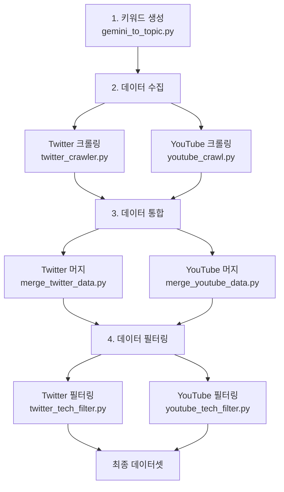

# 🚀 AI/IT 트렌드 분석 파이프라인

AI 및 IT 분야의 최신 트렌드를 자동으로 수집, 분석하는 데이터 파이프라인입니다.

## 📋 전체 워크플로우



---

## 🔄 실행 순서

### Step 1: 키워드 생성

**파일**: `youtube_tech_trend_pipeline/gemini_to_topic.py`

기술 블로그 RSS 피드에서 최신 트렌드 키워드를 추출합니다.

```bash
uv run python youtube_tech_trend_pipeline/gemini_to_topic.py
```

**입력**:

- GeekNews RSS 피드
- 한국 IT 기술 블로그 RSS 피드

**출력**:

- `gemini_trend_keywords_YYYYMMDD_HHMM.csv`
- 컬럼: `keyword`

**주요 설정**:

- Gemini API를 사용한 키워드 추출
- 중복 제거 및 품질 필터링
- AI/IT 도메인에 특화된 키워드

---

### Step 2: 데이터 수집

#### 2-1. Twitter 데이터 수집

**파일**: `youtube_tech_trend_pipeline/twitter_crawler.py`

생성된 키워드로 트위터에서 관련 트윗을 수집합니다.

> **⚠️ 중요**: 실행 전 `twitter_crawler.py` 파일을 열어서 `CSV_FILE_PATH` 경로를 Step 1에서 생성된 파일명으로 변경해야 합니다!

```bash
# 1. twitter_crawler.py 파일 열기
# 2. CSV_FILE_PATH = "gemini_trend_keywords_YYYYMMDD_HHMM.csv" 수정
# 3. 저장 후 실행
uv run python youtube_tech_trend_pipeline/twitter_crawler.py
```

**설정 파라미터** (`twitter_crawler.py` 상단):

```python
CSV_FILE_PATH = "gemini_trend_keywords_YYYYMMDD_HHMM.csv"  # ⚠️ 반드시 변경!
MIN_RETWEETS = 10        # 최소 리트윗 수
SEARCH_DAYS = 365        # 검색 기간 (일)
TWEETS_PER_QUERY_GROUP = 300  # 키워드당 수집 목표
```

**출력**:

- `data/twitter/twitter_retweet_filtered_YYYYMMDD_HHMM.csv`
- 컬럼: `text`, `reply`, `retweet`, `like`, `view`, `created_at`, `search_keyword`, `search_query`

**주요 특징**:

- 키워드별 독립 검색 (OR 조합으로 검색 범위 확대)
- 날짜 기반 필터링 (`since`, `until`)
- 최소 리트윗 수 필터링 (품질 관리)
- 30개 노이즈 키워드 제외 (아이돌, 스포츠, 도박 등)

---

#### 2-2. YouTube 데이터 수집

**파일**: `youtube_tech_trend_pipeline/youtube_crawl.py`

생성된 키워드로 유튜브 영상 및 댓글을 수집합니다.

> **⚠️ 중요**: 실행 전 `youtube_crawl.py` 파일을 열어서 `INPUT_KEYWORD_FILE` 경로를 Step 1에서 생성된 파일명으로 변경해야 합니다!

```bash
# 1. youtube_crawl.py 파일 열기
# 2. INPUT_KEYWORD_FILE = "gemini_trend_keywords_YYYYMMDD_HHMM.csv" 수정
# 3. 저장 후 실행
uv run python youtube_tech_trend_pipeline/youtube_crawl.py
```

**설정 파라미터** (`youtube_crawl.py` 상단):

```python
INPUT_KEYWORD_FILE = "gemini_trend_keywords_YYYYMMDD_HHMM.csv"  # ⚠️ 반드시 변경!
VIDEOS_PER_KEYWORD = 5    # 키워드당 영상 수
COMMENTS_PER_VIDEO = 20   # 영상당 댓글 수
```

**출력**:

- `data/youtube/final_dataset_youtube_YYYYMMDD_HHMM.csv`
- 컬럼: `video_title`, `video_url`, `video_likes`, `comment_text`, `comment_likes`, `search_keyword`

---

### Step 3: 데이터 통합

여러 번 수집한 데이터를 하나로 통합하고 중복을 제거합니다.

#### 3-1. Twitter 데이터 머지

**파일**: `data_processing/merge_twitter_data.py`

```bash
uv run python data_processing/merge_twitter_data.py
```

**동작**:

- `data/twitter/` 폴더의 모든 CSV 파일 통합
- `text` 컬럼 기준 중복 제거
- 날짜 범위 및 키워드 통계 출력

**출력**:

- `data/twitter/twitter_merged_YYYYMMDD_HHMM.csv`

---

#### 3-2. YouTube 데이터 머지

**파일**: `data_processing/merge_youtube_data.py`

```bash
uv run python data_processing/merge_youtube_data.py
```

**동작**:

- `data/youtube/` 폴더의 모든 CSV 파일 통합
- 완전히 동일한 행만 중복 제거 (영상 + 댓글 보존)
- 영상/키워드/댓글 통계 출력

**출력**:

- `data/youtube/youtube_merged_YYYYMMDD_HHMM.csv`

---

### Step 4: 기술 도메인 필터링

SBERT를 사용하여 AI/IT 기술 도메인과 관련 없는 데이터를 필터링합니다.

#### 4-1. Twitter 필터링

**파일**: `data_processing/twitter_tech_filter.py`

```bash
uv run python data_processing/twitter_tech_filter.py
```

**설정**:

```python
TWITTER_CSV = "data/twitter/twitter_merged_YYYYMMDD_HHMM.csv"  # Step 3-1 출력
SIMILARITY_THRESHOLD = 0.3  # 임계값 (0~1, 높을수록 엄격)
```

**필터링 과정**:

1. **키워드 필터**: 명백한 노이즈 제거 (아이돌, 스포츠 등)
2. **SBERT 유사도**: 기술 도메인 레퍼런스와 코사인 유사도 계산

**출력**:

- `twitter_tech_filtered_YYYYMMDD_HHMM.csv`
- 추가 컬럼: `tech_similarity` (0~1)

---

#### 4-2. YouTube 필터링

**파일**: `data_processing/youtube_tech_filter.py`

```bash
uv run python data_processing/youtube_tech_filter.py
```

**설정**:

```python
YOUTUBE_CSV = "data/youtube/youtube_merged_YYYYMMDD_HHMM.csv"  # Step 3-2 출력
SIMILARITY_THRESHOLD = 0.3
```

**필터링 과정**:

1. 고유 영상 제목 추출
2. 키워드 기반 필터링
3. SBERT 유사도 필터링 (영상 제목 기준)
4. 원본 데이터와 병합 (필터링된 영상의 모든 댓글 보존)

**출력**:

- `youtube_tech_filtered_YYYYMMDD_HHMM.csv`
- 추가 컬럼: `tech_similarity` (0~1)

---

## 📊 최종 데이터셋

### Twitter 최종 데이터

- **경로**: `twitter_tech_filtered_YYYYMMDD_HHMM.csv`
- **예상 데이터량**: 1,000~5,000개 트윗
- **보존율**: 약 40~50%

### YouTube 최종 데이터

- **경로**: `youtube_tech_filtered_YYYYMMDD_HHMM.csv`
- **예상 데이터량**: 400~600개 영상 + 6,000~7,000개 댓글
- **보존율**: 약 70~80%

---

## ⚙️ 환경 설정

### 1. Python 패키지 설치

```bash
uv sync
```

주요 패키지:

- `pandas`: 데이터 처리
- `sentence-transformers`: SBERT 임베딩
- `undetected-chromedriver`: 웹 크롤링
- `kiwipiepy`: 한국어 형태소 분석

### 2. 환경 변수 설정

`.env` 파일에 Gemini API 키 추가:

```
GEMINI_API_KEY=your_api_key_here
```

### 3. Chrome 브라우저

Twitter/YouTube 크롤러 실행 시 Chrome 브라우저가 필요합니다.

---

## 🔧 주요 설정 파라미터

### 키워드 생성 (gemini_to_topic.py)

- `MAX_KEYWORDS`: 최대 키워드 수 (기본: 100)
- `MODEL_NAME`: Gemini 모델 (기본: `gemini-1.5-flash`)

### Twitter 크롤러 (twitter_crawler.py)

- `MIN_RETWEETS`: 최소 리트윗 수 (기본: 10)
- `SEARCH_DAYS`: 검색 기간 (기본: 365일)
- `TWEETS_PER_QUERY_GROUP`: 키워드당 수집 목표 (기본: 300)

### YouTube 크롤러 (youtube_crawl.py)

- `VIDEOS_PER_KEYWORD`: 키워드당 영상 수 (기본: 5)
- `COMMENTS_PER_VIDEO`: 영상당 댓글 수 (기본: 20)

### 필터링 (tech_filter.py)

- `SIMILARITY_THRESHOLD`: 유사도 임계값 (기본: 0.3)
  - 0.4~0.5: 순수 기술 콘텐츠만
  - 0.3: 균형잡힌 필터링
  - 0.2~0.3: 기술 주변 콘텐츠 포함

---

## 📁 디렉토리 구조

```
비모/
├── youtube_tech_trend_pipeline/    # 1단계: 키워드 생성 & 수집
│   ├── gemini_to_topic.py         # 키워드 생성
│   ├── twitter_crawler.py         # Twitter 크롤러
│   └── youtube_crawl.py           # YouTube 크롤러
├── data_processing/                # 3-4단계: 통합 & 필터링
│   ├── merge_twitter_data.py      # Twitter 머지
│   ├── merge_youtube_data.py      # YouTube 머지
│   ├── twitter_tech_filter.py     # Twitter 필터링
│   └── youtube_tech_filter.py     # YouTube 필터링
├── data/                           # 수집된 데이터
│   ├── twitter/                   # Twitter 데이터
│   └── youtube/                   # YouTube 데이터
└── gemini_trend_keywords_*.csv    # 생성된 키워드
```

---

## 🚨 문제 해결

### 1. Twitter 크롤러 에러

- **증상**: `invalid session id` 또는 `KeyboardInterrupt`
- **원인**: `undetected_chromedriver` 불안정
- **해결**: 스크립트 재실행 또는 Chrome 업데이트

### 2. 데이터가 너무 적음

- **Twitter**: `MIN_RETWEETS` 값을 낮춤 (10 → 5)
- **YouTube**: `VIDEOS_PER_KEYWORD` 값을 높임 (5 → 10)

### 3. 노이즈가 많음

- **필터링**: `SIMILARITY_THRESHOLD` 값을 높임 (0.3 → 0.4)
- **크롤러**: `QUERY_EXCLUDE_KEYWORDS` 리스트에 노이즈 키워드 추가

---

## 📈 다음 단계

필터링된 데이터로 할 수 있는 분석:

1. **키워드 추출**: BERTopic, TF-IDF
2. **감성 분석**: 긍정/부정 트렌드 파악
3. **시계열 분석**: ARIMA 모델로 트렌드 예측
4. **워드 임베딩**: Word2Vec으로 키워드 관계 분석

---

## 📝 라이센스

MIT License

## 👤 Author

이종민 (AI/IT 트렌드 연구)
